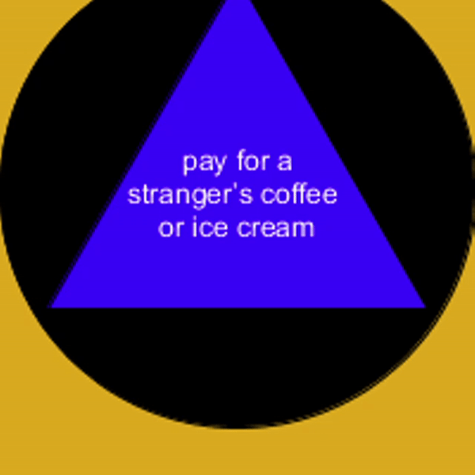

# 🎱 Happy 8-Ball

> Magic 8 Ball for happy tasks

## Demo

## Usage

1. [Download Processing.](https://processing.org/download/)
1. Open [`happy_8_ball.pde`](happy_8_ball/happy_8_ball.pde) in Processing.
1. Click the ▶ (_run_) button.

## Inspiration

AP Psychology end-of-the-year happiness unit.

---

Created with 💖 by [EthanThatOneKid](https://github.com/EthanThatOneKid)
